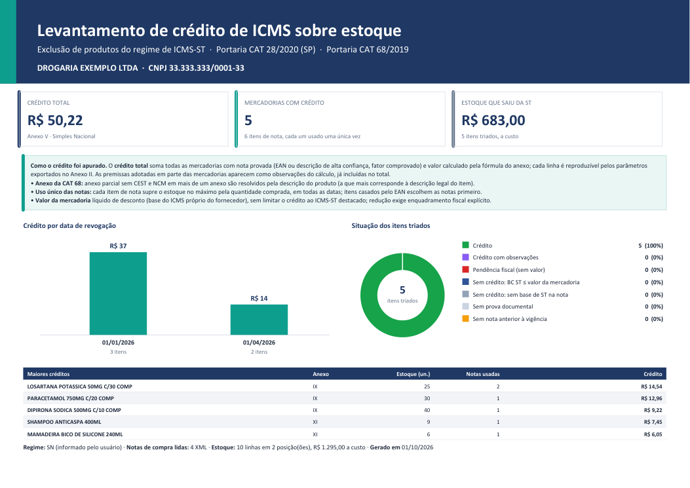
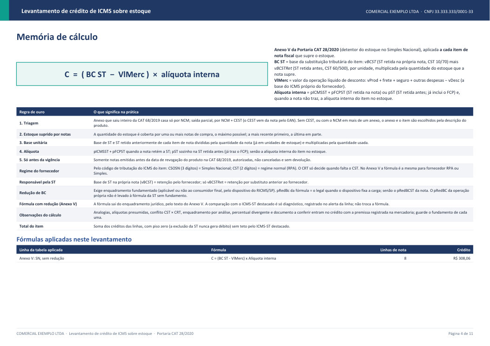
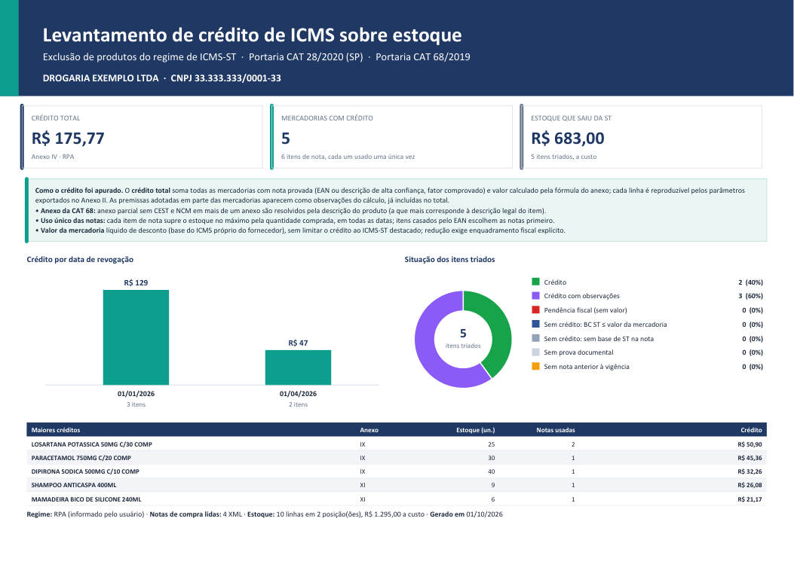
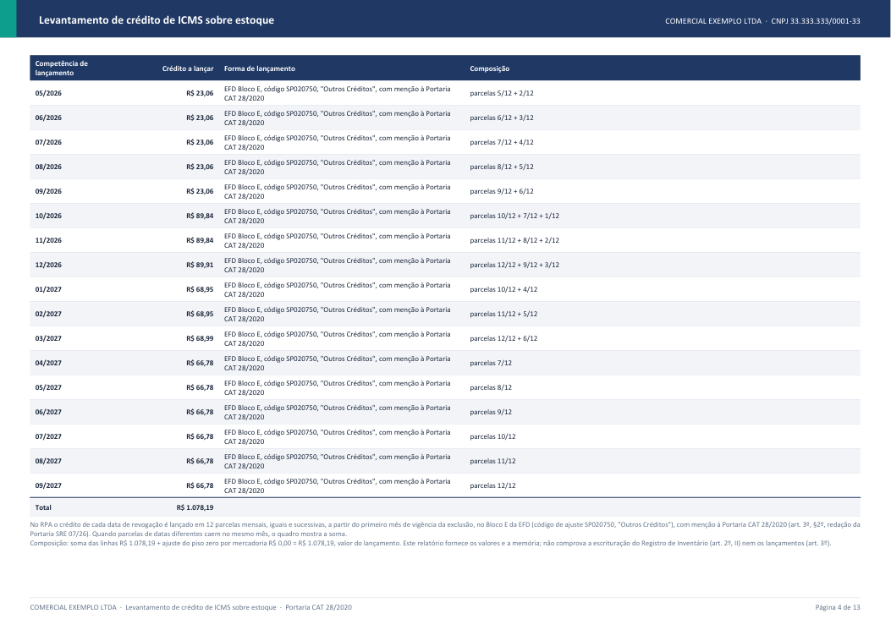
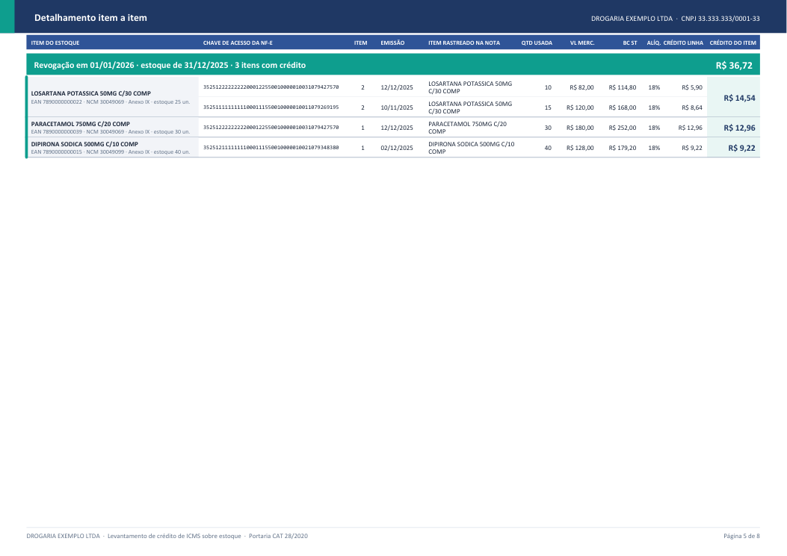

# Crédito de ICMS sobre estoque excluído da ST (SP) — skill `credito-icms-estoque-st`

Uma skill do Claude que faz, de ponta a ponta, o **levantamento do crédito de ICMS sobre o estoque** de mercadorias de qualquer segmento que saíram do regime de substituição tributária em São Paulo, conforme a **Portaria CAT 28/2020** (Anexos IV e V) e a relação de produtos revogados da **Portaria CAT 68/2019**.

Você entrega as notas de compra (XML) e a posição de estoque. A skill devolve **uma planilha Excel e um relatório em PDF**, com o crédito por item, a nota fiscal que o sustenta (chave de acesso e item), a fórmula aplicada e o plano de lançamento (PGDAS-D para o Simples Nacional; 12 parcelas no Bloco E, código SP020750, para o Regime Periódico de Apuração).

> **Aviso.** A skill automatiza a apuração e documenta cada premissa, mas **não substitui a análise do contador ou do advogado tributarista**. O crédito é passível de fiscalização: guarde as notas, o relatório e o fundamento das observações do cálculo. O relatório não comprova a escrituração do Registro de Inventário (Bloco H) nem os lançamentos do crédito.

## Para quais segmentos serve

Para **qualquer empresa paulista com estoque de produtos que saíram da ST**: varejo, atacado, distribuidoras, oficinas e lojas de autopeças, materiais de construção, supermercados, farmácias e outros. A base cobre os 18 anexos da CAT 68/2019:

| Anexo da CAT 68/2019 | Segmento |
|---|---|
| III | Cerveja, chope, refrigerante, água e outras bebidas |
| IV | Sorvete e preparado para fabricação de sorvete |
| VII | Pneumáticos, câmaras de ar e protetores de borracha |
| VIII | Tintas, vernizes e outros produtos da indústria química |
| IX | Medicamentos |
| X | Bebidas alcoólicas |
| XI | Produtos de perfumaria e de higiene pessoal |
| XII | Ração animal |
| XIII | Produtos de limpeza |
| XIV | Autopeças |
| XV | Lâmpadas, reatores e "starter" |
| XVI | Produtos da indústria alimentícia |
| XVII | Materiais de construção e congêneres |
| XVIII | Ferramentas |
| XIX | Produtos de papelaria e papel |
| XX | Artefatos de uso doméstico |
| XXI | Materiais elétricos |
| XXII | Produtos eletrônicos, eletroeletrônicos e eletrodomésticos |

## O que enviar

1. **Pasta (ou .zip) com os XMLs das notas de compra**: quanto mais notas, melhor o cruzamento.
2. **Relatório com a posição de estoque**, um arquivo por data (`estoque 31.12.2025.xls`). Só **descrição e quantidade** são indispensáveis; **EAN, NCM, custo unitário e código** tornam o cruzamento mais seguro. Sem EAN/NCM, a skill identifica o produto pela descrição nas notas de compra. Aceita estruturas diferentes (custo por caixa, nomes de colunas livres, totais em fórmula).
3. **Razão social, CNPJ e regime** (Simples Nacional ou RPA).

O detalhe de cada campo e dicas de preenchimento estão em [`docs/O-QUE-ENVIAR.md`](docs/O-QUE-ENVIAR.md), que também serve de roteiro para pedir os arquivos ao cliente.

## O que ela faz

| Etapa | O que acontece |
|---|---|
| 1. Lê o pacote | Abre a pasta ou o `.zip` com milhares de XMLs de NF-e (e eventos de cancelamento) e as posições de estoque (`estoque 31.12.2025.xls`). Descarta duplicatas, aplica cancelamentos e valida as colunas obrigatórias. |
| 2. Tria o estoque | Aplica a **regra de ouro**: anexo que saiu inteiro da ST casa só pelo **NCM**; anexo que saiu em parte casa por **NCM + CEST**. Sem CEST, ou com o NCM em mais de um anexo, o anexo e o item são escolhidos pela **descrição do produto**. |
| 3. Localiza nas notas | Cada item do estoque é procurado nas notas de compra por **EAN** e, se não achar, pela **descrição** (nome, dose, embalagem, laboratório...). Só entra nota com prova. |
| 4. Aloca as notas | A quantidade do estoque é suprida por uma ou mais notas, da mais recente para a mais antiga, **só notas anteriores à data da exclusão**. Cada item de nota é usado **uma única vez** em todo o levantamento. |
| 5. Calcula o crédito | Fórmula do **Anexo V** (Simples Nacional) ou **Anexo IV** (RPA), por item de nota, com base de ST unitária × quantidade em estoque e a alíquota da própria nota. Regime do fornecedor identificado pelo CST/CSOSN do ICMS. |
| 6. Gera os documentos | `resultado_levantamento.xlsx` (5 abas) e `relatorio_levantamento.pdf` (resumo, memória de cálculo, detalhamento item a item com chave de acesso, pendências). |
| 0. Panorama (opcional) | `panorama_cat68.py` lista tudo que saiu e vai sair da ST em um ano, por data, anexo e item, e diz quais posições de estoque pedir ao cliente. |
| 7. Reconcilia | `reconciliar.py` compara duas versões das regras e mostra, por produto e por motivo, por que o total mudou. |

O crédito é **unificado**: todo valor calculado entra no total. As premissas adotadas em parte das linhas (por exemplo, alíquota presumida de 18% quando a nota e o cadastro não trazem a alíquota) aparecem como **observações do cálculo**, já somadas, para você documentar.

## Como é o relatório

Os exemplos abaixo usam uma **empresa fictícia**, com produtos de oito anexos (medicamento, lâmpada, alimento, higiene, sorvete, eletrodoméstico, tinta e pneu) e um item que continua na ST (impressora, que fica fora), (`COMERCIAL EXEMPLO LTDA`) e notas inventadas, geradas por [`exemplos/gerar_pacote_demo.py`](exemplos/gerar_pacote_demo.py). Os arquivos completos estão em [`exemplos/modelo-SN`](exemplos/modelo-SN) e [`exemplos/modelo-RPA`](exemplos/modelo-RPA).

### Simples Nacional (Anexo V)

| Resumo | Memória de cálculo |
|---|---|
|  |  |

### Regime Periódico de Apuração (Anexo IV)

| Resumo | Lançamento em 12 parcelas |
|---|---|
|  |  |

### Detalhamento item a item (chave de acesso + item rastreado + crédito)



## Panorama: o que saiu e o que vai sair da ST em 2026

```bash
python scripts/panorama_cat68.py --ano 2026 --saida panorama
```

Gera `panorama_cat68_2026.xlsx` com 5 abas: **Resumo por data** (já saiu / vai sair, ato revogador, anexos e posição de estoque necessária), **Por anexo**, **Itens** (468 itens com NCM, CEST, descrição e critério de triagem), **Posições de estoque** (os arquivos a pedir ao cliente, um por data de saída) e **Ainda na ST** (277 itens que continuam sujeitos à ST). A situação é calculada pela data de hoje. A base cobre cinco datas em 2026 (01/01, 01/04, 01/07, 01/08 e 01/10); não há saída futura registrada depois de 01/10/2026, e a lista deve ser conferida contra atos novos (ver `references/base-legal/README.md`).

## Começando em 5 minutos

```bash
pip install -r requirements.txt
python exemplos/gerar_pacote_demo.py            # cria um pacote fictício em exemplos/pacote_demo
python scripts/preparar_cliente.py --cliente "COMERCIAL EXEMPLO LTDA" --cnpj 33.333.333/0001-33 --pacote exemplos/pacote_demo --saida minha_saida --regime SN
python scripts/levantamento.py "minha_saida/COMERCIAL EXEMPLO LTDA"
python scripts/gerar_relatorio.py "minha_saida/COMERCIAL EXEMPLO LTDA"
```

Com dados reais, troque `--pacote` pela pasta ou zip com os XMLs e as posições de estoque, e use `--regime RPA` ou `SN`. O passo a passo completo, a leitura dos resultados e as perguntas frequentes estão no **[guia de uso](docs/GUIA-DE-USO.md)**.

## Instalação

1. Python 3.10 ou superior.
2. Instale as dependências (a skill confere e instala sozinha, ou faça manualmente):

```bash
python scripts/verificar_ambiente.py --instalar
# ou: pip install -r requirements.txt
```

3. Valide: `python -m pytest scripts/tests -q`.

## Usando como skill no Claude

Copie esta pasta (`credito-icms-estoque-st`) para o diretório de skills do Claude (por exemplo, `~/.claude/skills/`). Ao pedir para instalar ou na primeira execução, o Claude roda `scripts/verificar_ambiente.py --instalar`. Depois peça, por exemplo: *"Faça o levantamento de crédito de ICMS do estoque da Drogaria X (SN) com o pacote em `C:\clientes\X.zip`."* O `SKILL.md` instrui o Claude a montar a pasta do cliente, rodar o levantamento, analisar as pendências com evidência e gerar os dois documentos.

## O que está nesta pasta

| Caminho | Conteúdo |
|---|---|
| `SKILL.md` | Instruções da skill (o que o Claude lê) |
| `scripts/` | Parser de NF-e, triagem, localização, alocação, fórmulas, planilha, PDF, reconciliação e testes |
| `references/` | Regras do levantamento, matriz de fórmulas, base legal (portarias em HTML/TXT, lista de produtos revogados) |
| `exemplos/` | Gerador do pacote fictício e os modelos de saída (SN e RPA) |
| `docs/` | Guia de uso e imagens do relatório |

## Qualidade

`python -m pytest scripts/tests -q` roda os testes (parser, triagem, alocação, fórmulas dos Anexos IV/V, relatório e um ponta a ponta com o pacote fictício, nos dois regimes).

## Limites conhecidos

- Cobre **São Paulo** (CAT 28/2020 e CAT 68/2019). A base de produtos revogados é versionada em `references/base-legal`; antes de fechar um levantamento, confira se saiu ato novo.
- A leitura do estoque é adaptativa (nomes de coluna livres, sem EAN/NCM, custo por caixa), mas a identificação **pela descrição** só funciona quando o produto tem nota de compra com nome parecido; o que não for identificado com segurança fica fora do crédito e vai para `identificacao_estoque.csv`.
- **Qualquer segmento, com ressalvas.** A triagem pela CAT 68, a alocação das notas e as fórmulas valem para os 18 anexos. O casamento **por descrição** (quando o EAN não aparece nas notas) foi calibrado com produtos de farmácia e perfumaria; nos demais segmentos o casamento pelo **EAN** é o caminho principal, e o que não casa com segurança fica fora do crédito, com o motivo registrado. O enquadramento automático da redução de base de cálculo cobre só os medicamentos do art. 3º, XXIV do Anexo II do RICMS/SP; reduções de outros segmentos vão para análise com evidência (`enquadramento_reducao.csv`).
- Algumas leituras da portaria são **interpretações registradas** (piso zero por mercadoria, valor da mercadoria líquido de desconto, FCP com base própria, analogias do Anexo IV, parcela do art. 3º, §4º / CAT 75/08 não deduzida). Elas estão na seção "Pontos de atenção" do PDF.

## Licença

Código sob licença [MIT](LICENSE). A skill é uma ferramenta de apoio: o uso dos resultados e a responsabilidade pelo crédito apurado são do contribuinte e do seu contador.
