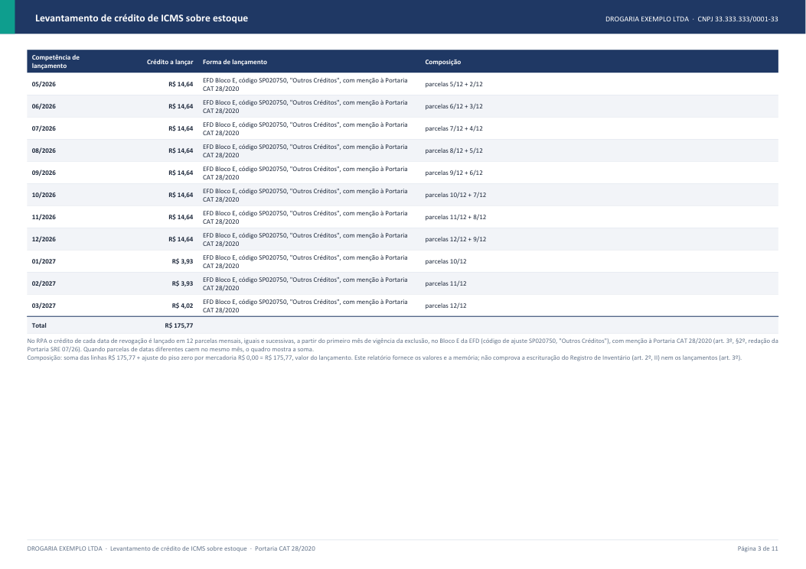

# Crédito de ICMS sobre estoque excluído da ST (SP) — skill `credito-icms-estoque-st`

Uma skill do Claude que faz, de ponta a ponta, o **levantamento do crédito de ICMS sobre o estoque** de mercadorias que saíram do regime de substituição tributária em São Paulo, conforme a **Portaria CAT 28/2020** (Anexos IV e V) e a relação de produtos revogados da **Portaria CAT 68/2019**.

Você entrega as notas de compra (XML) e a posição de estoque. A skill devolve **uma planilha Excel e um relatório em PDF**, com o crédito por item, a nota fiscal que o sustenta (chave de acesso e item), a fórmula aplicada e o plano de lançamento (PGDAS-D para o Simples Nacional; 12 parcelas no Bloco E, código SP020750, para o Regime Periódico de Apuração).

> **Aviso.** A skill automatiza a apuração e documenta cada premissa, mas **não substitui a análise do contador ou do advogado tributarista**. O crédito é passível de fiscalização: guarde as notas, o relatório e o fundamento das observações do cálculo. O relatório não comprova a escrituração do Registro de Inventário (Bloco H) nem os lançamentos do crédito.

## O que ela faz

| Etapa | O que acontece |
|---|---|
| 1. Lê o pacote | Abre a pasta ou o `.zip` com milhares de XMLs de NF-e (e eventos de cancelamento) e as posições de estoque (`estoque 31.12.2025.xls`). Descarta duplicatas, aplica cancelamentos e valida as colunas obrigatórias. |
| 2. Tria o estoque | Aplica a **regra de ouro**: anexo que saiu inteiro da ST casa só pelo **NCM**; anexo que saiu em parte casa por **NCM + CEST**. Sem CEST, ou com o NCM em mais de um anexo, o anexo e o item são escolhidos pela **descrição do produto**. |
| 3. Localiza nas notas | Cada item do estoque é procurado nas notas de compra por **EAN** e, se não achar, pela **descrição** (nome, dose, embalagem, laboratório...). Só entra nota com prova. |
| 4. Aloca as notas | A quantidade do estoque é suprida por uma ou mais notas, da mais recente para a mais antiga, **só notas anteriores à data da exclusão**. Cada item de nota é usado **uma única vez** em todo o levantamento. |
| 5. Calcula o crédito | Fórmula do **Anexo V** (Simples Nacional) ou **Anexo IV** (RPA), por item de nota, com base de ST unitária × quantidade em estoque e a alíquota da própria nota. Regime do fornecedor identificado pelo CST/CSOSN do ICMS. |
| 6. Gera os documentos | `resultado_levantamento.xlsx` (5 abas) e `relatorio_levantamento.pdf` (resumo, memória de cálculo, detalhamento item a item com chave de acesso, pendências). |
| 7. Reconcilia | `reconciliar.py` compara duas versões das regras e mostra, por produto e por motivo, por que o total mudou. |

O crédito é **unificado**: todo valor calculado entra no total. As premissas adotadas em parte das linhas (por exemplo, alíquota presumida de 18% quando a nota e o cadastro não trazem a alíquota) aparecem como **observações do cálculo**, já somadas, para você documentar.

## Como é o relatório

Os exemplos abaixo usam uma **empresa fictícia** (`DROGARIA EXEMPLO LTDA`) e notas inventadas, geradas por [`exemplos/gerar_pacote_demo.py`](exemplos/gerar_pacote_demo.py). Os arquivos completos estão em [`exemplos/modelo-SN`](exemplos/modelo-SN) e [`exemplos/modelo-RPA`](exemplos/modelo-RPA).

### Simples Nacional (Anexo V)

| Resumo | Memória de cálculo |
|---|---|
|  |  |

### Regime Periódico de Apuração (Anexo IV)

| Resumo | Lançamento em 12 parcelas |
|---|---|
|  |  |

### Detalhamento item a item (chave de acesso + item rastreado + crédito)


## Começando em 5 minutos

```bash
pip install -r requirements.txt
python exemplos/gerar_pacote_demo.py            # cria um pacote fictício em exemplos/pacote_demo
python scripts/preparar_cliente.py --cliente "DROGARIA EXEMPLO LTDA" --cnpj 33.333.333/0001-33 --pacote exemplos/pacote_demo --saida minha_saida --regime SN
python scripts/levantamento.py "minha_saida/DROGARIA EXEMPLO LTDA"
python scripts/gerar_relatorio.py "minha_saida/DROGARIA EXEMPLO LTDA"
```

Com dados reais, troque `--pacote` pela pasta ou zip com os XMLs e as posições de estoque, e use `--regime RPA` ou `SN`. O passo a passo completo, a leitura dos resultados e as perguntas frequentes estão no **[guia de uso](docs/GUIA-DE-USO.md)**.

## Instalação

1. Python 3.10 ou superior.
2. Instale as dependências (a skill confere e instala sozinha, ou faça manualmente):

```bash
python scripts/verificar_ambiente.py --instalar
# ou: pip install -r requirements.txt
```

3. Valide: `python -m pytest scripts/tests -q`.

## Usando como skill no Claude

Copie esta pasta (`credito-icms-estoque-st`) para o diretório de skills do Claude (por exemplo, `~/.claude/skills/`). Ao pedir para instalar ou na primeira execução, o Claude roda `scripts/verificar_ambiente.py --instalar`. Depois peça, por exemplo: *"Faça o levantamento de crédito de ICMS do estoque da Drogaria X (SN) com o pacote em `C:\clientes\X.zip`."* O `SKILL.md` instrui o Claude a montar a pasta do cliente, rodar o levantamento, analisar as pendências com evidência e gerar os dois documentos.

## O que está nesta pasta

| Caminho | Conteúdo |
|---|---|
| `SKILL.md` | Instruções da skill (o que o Claude lê) |
| `scripts/` | Parser de NF-e, triagem, localização, alocação, fórmulas, planilha, PDF, reconciliação e testes |
| `references/` | Regras do levantamento, matriz de fórmulas, base legal (portarias em HTML/TXT, lista de produtos revogados) |
| `exemplos/` | Gerador do pacote fictício e os modelos de saída (SN e RPA) |
| `docs/` | Guia de uso e imagens do relatório |

## Qualidade

`python -m pytest scripts/tests -q` roda os testes (parser, triagem, alocação, fórmulas dos Anexos IV/V, relatório e um ponta a ponta com o pacote fictício, nos dois regimes).

## Limites conhecidos

- Cobre **São Paulo** (CAT 28/2020 e CAT 68/2019). A base de produtos revogados é versionada em `references/base-legal`; antes de fechar um levantamento, confira se saiu ato novo.
- Layout de estoque validado com o relatório "Posição de Estoque" de uma drogaria; outros ERPs podem exigir ajuste de colunas.
- Algumas leituras da portaria são **interpretações registradas** (piso zero por mercadoria, valor da mercadoria líquido de desconto, FCP com base própria, analogias do Anexo IV, parcela do art. 3º, §4º / CAT 75/08 não deduzida). Elas estão na seção "Pontos de atenção" do PDF.

## Licença

Código sob licença [MIT](LICENSE). A skill é uma ferramenta de apoio: o uso dos resultados e a responsabilidade pelo crédito apurado são do contribuinte e do seu contador.
